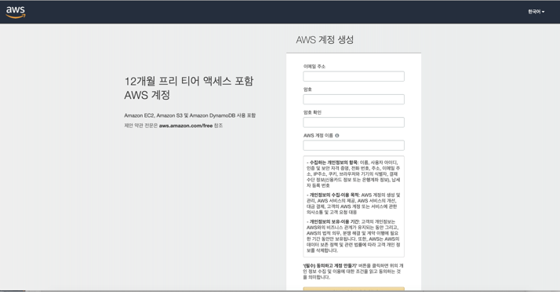

Chapter 2. 협업 툴 활용 A-Z

**서비스 운영에 기본이 되는 협업툴과 클라우드 서비스에 대한 기본적인 지식을 습득합니다.**

Chapter 2-2. (2)Jira 협업툴 설치하기

* 대부분 강의에 나온 내용을 기반으로 이 강의 보충 설명에는 소스 설명이 조금 더 필요한 경우 첨부하여 작성하였습니다. 

지라란?
- 아틀라시안 제품중 하나로써 일정을 관리하고 협업을 하기에 적합한 도구중 하나

아틀라시안 홈페이지
- https://www.atlassian.com/

> 대부분의 제품은 30일간 무료로 사용해 볼 수 있습니다. 

AWS에 접속해서 Jira 툴을 설치하는 과정을 진행합니다.

작업 순서 : 

1. AWS 계정 만들기 > 

2. AWS 리전 생성 (서버 생성) > 

3. AWS 터미널 통해 AWS 접속 >

4. 리눅스 버젼 확인하기 (Centos, RedHat 등등) >

5. 도커 설치하기 >

6. 도커 올라온 리스트 확인하기 > 

7. 도커 시작하기 >

8. 지라 도커 설치하기 >

9. 지라 도커 생성하기 >

10. 지라 도커 실행하기 >

11. 만들어진 AWS 지라로 접속해서 지라 확인해보기


<code></code>

1. AWS 계정 만들기 > 

AWS 홈페이지 https://aws.amazon.com/ko/



2. AWS 리전 생성 (서버 생성) > 


> EC2 선택


> 인스턴스 시작


> AMI 2 Linux 선택 -> 원하는 다른 유형의 서버를 선택해도됨 (다만 다 다른 조치가 필요)


> 인스턴스 유형 선택
> t2.large (프리티어가 아니면 비용이 나가므로 테스트 후 인스턴스 종료 필요)


> 보안 그룹 구성, 검토 및 시작


> 처음 생성시 키페어 저장 후 필요한 키 저장 폴더에 해당 키 명칭 작성후 저장


3. AWS 터미널 통해 AWS 접속 >

``` 
ssh -i chicken.pem  ec2-user@13.125.234.161
```

4. 리눅스 버젼 확인하기 (Centos, RedHat 등등) >

5. 도커 설치하기 >

``` 
sudo yum install docker-io   -- yes
``` 

6. 도커 올라온 리스트 확인하기 > 
``` 
docker ps -a 
``` 

7. 도커 시작하기 >
``` 
sudo systemctl start docker 
``` 

8. 지라 도커 컨테이너 설치하기 >

``` 
docker pull cptactionhank/atlassian-jira-software:latest
``` 

9. 지라 도커 컨테이너 생성하기 >
``` 
docker create --restart=no --name "jira-container" \
  --publish "8080:8080" \
  --volume "hostpath:/var/atlassian/jira" \
  --env "CATALINA_OPTS= -Xms1024m -Xmx1024m -Datlassian.plugins.enable.wait=300" \
  cptactionhank/atlassian-jira-software:latest 
``` 


10. 지라 도커 실행하기 >
``` 
docker start --attach "jira-container"
``` 
* 아무 옵션도 없이 실행할 경우 실행 종료시 도커도 같이 종료됨

11. 만들어진 AWS 지라로 접속해서 지라 확인해보기


**목차**

[Chapter 1. 오리엔테이션과 시작하기](https://gitlab.com/bloodjino1/fastcampus-lecture-codes_aws-docker/-/tree/master/chapter1)

[Chapter 2. 협업 툴 활용 A-Z](https://gitlab.com/bloodjino1/fastcampus-lecture-codes_aws-docker/-/tree/master/chapter2)

 [Chapter 2-1. (1)Jira 협업툴 소개](https://gitlab.com/bloodjino1/fastcampus-lecture-codes_aws-docker/-/tree/master/chapter2/(1)Jira%20협업툴%20소개)

 [Chapter 2-2. (2)Jira 협업툴 설치하기](https://gitlab.com/bloodjino1/fastcampus-lecture-codes_aws-docker/-/tree/master/chapter2/(2)Jira%20협업툴%20설치하기)

 [Chapter 2-3. (3)Jira Issue 이해하기](https://gitlab.com/bloodjino1/fastcampus-lecture-codes_aws-docker/-/tree/master/chapter2/(3)Jira%20Issue%20이해하기)

 [Chapter 2-4. (4)Jira API 소개 및 Postman 활용하기](https://gitlab.com/bloodjino1/fastcampus-lecture-codes_aws-docker/-/tree/master/chapter2/(4)Jira%20API%20소개%20및%20Postman%20활용하기)

 [Chapter 2-5. (5)Jira 관리자 소개](https://gitlab.com/bloodjino1/fastcampus-lecture-codes_aws-docker/-/tree/master/chapter2/(5)Jira%20관리자%20소개)

 [Chapter 2-6. (6)Jira 워크플로우 설정하기](https://gitlab.com/bloodjino1/fastcampus-lecture-codes_aws-docker/-/tree/master/chapter2/(6)Jira%20워크플로우%20설정하기)

 [Chapter 2-7. (7)Jira CustomField 설정하기](https://gitlab.com/bloodjino1/fastcampus-lecture-codes_aws-docker/-/tree/master/chapter2/(7)Jira%20CustomField%20설정하기)

 [Chapter 2-8. (8)Jira DB 구조 설명](https://gitlab.com/bloodjino1/fastcampus-lecture-codes_aws-docker/-/tree/master/chapter2/(8)Jira%20DB%20구조%20설명)
 
 [Chapter 2-9. (9)Confluence 협업 툴 소개](https://gitlab.com/bloodjino1/fastcampus-lecture-codes_aws-docker/-/tree/master/chapter2/(9)Confluence%20협업%20툴%20소개)

 [Chapter 2-10. (10)Confluence 협업 툴 사용 방법](https://gitlab.com/bloodjino1/fastcampus-lecture-codes_aws-docker/-/tree/master/chapter2/(10)Confluence%20협업%20툴%20사용%20방법)

[Chapter 3. 버전관리와 자동화 빌드 툴 이해하기](https://gitlab.com/bloodjino1/fastcampus-lecture-codes_aws-docker/-/tree/master/chapter3)

[Chapter 4.5. AWS 기본 설정 및 클라우드 서비스 환경 구축,
 AWS 활용 스프링부트 프로젝트 배포 -> 4](https://gitlab.com/bloodjino1/fastcampus-lecture-codes_aws-docker/-/tree/master/chapter4)

[Chapter 6. DOCKER 활용하기-> 5](https://gitlab.com/bloodjino1/fastcampus-lecture-codes_aws-docker/-/tree/master/chapter5)
