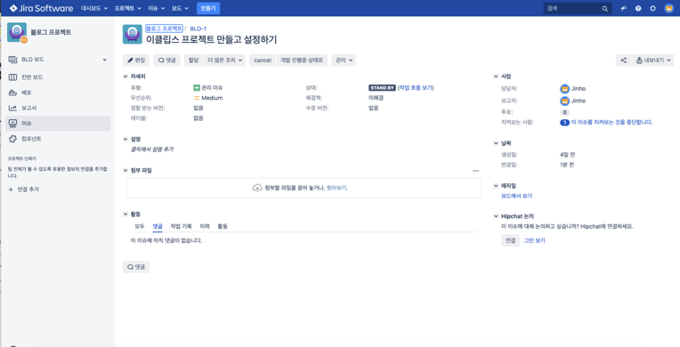
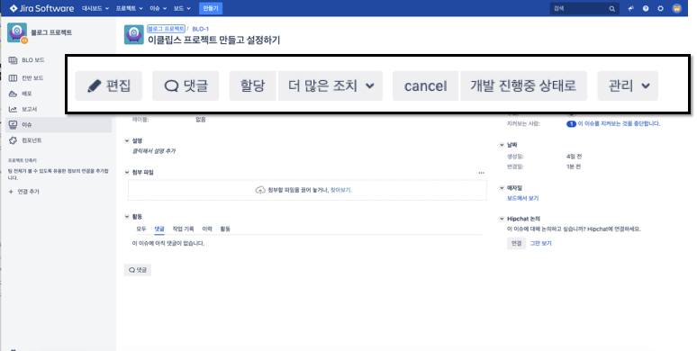

Chapter 2. 협업 툴 활용 A-Z

**서비스 운영에 기본이 되는 협업툴과 클라우드 서비스에 대한 기본적인 지식을 습득합니다.**

Chapter 2-3. (3)Jira Issue 이해하기

대부분 강의에 나온 내용을 기반으로 이 강의 보충 설명에는 소스 설명이 조금 더 필요한 경우 첨부하여 작성하였습니다.

* 지라 이슈 부분은 강의 자료의 설명으로 충분하기 때문에 따로 소스 코드를 작성하지는 않습니다.

지라의 구성은 프로젝트 단위로 구성 됩니다.
그리고 그 지라의 하위 프로젝트들은 Issue ID 라는 것으로 하나의 일 단위로 쪼개지게 됩니다.
그리고 Issue ID 는 Issue Status 는 각각의 이슈 상태들로 관리되게 됩니다. 이것을 이용해서 이슈를 관리하게 됩니다.
그리고 이런 이슈 상태에 대해서 다양한 방식으로 원하는 입맛에 맞추어 사용하게 되는데 이것들을 강의 3,4를 통해서 살펴보게 됩니다.

* 이슈 관리 영역
편집 – 이 버튼을 클릭하면 이슈에 대해서 수정을 할 수 있습니다.
댓글 – 지라에서는 다양한 사용자들이 서로 댓글을 통해서 서로의 이슈를 확인하고 대화할 수 있습니다. 
할당 – 이슈의 표현으로는 Assign이라고 합니다. 누가 이 업무를 소유하고 처리할지를 결정하게 됩니다. 
표현이 보고자라는 표현과 처리자, 혹은 담당자라는 표현이 서툴고 어색하기 때문에 혼동될 수 있습니다.
보고자 : 이 이슈를 작성한 사람을 의미
담당자 : 이 것을 처리해야하는 처리자라는 의미입니다. 
이 보고자( reporter ) 의 정보와 처리자 ( assignee ) 정보는 거의 필수적인 정보입니다. 
물론 커스텀이 가능하긴 하지만, 기본적으로 주어지는 정보입니다.
그 뒤에 더 많은 조치에서는 하위의 이슈를 만들 수 있습니다.

관리 앞쪽에 있는 것들은 상태를 변경시키는 영역입니다. 현재는 취소와 다음 상태로 넘길 수 있도록 만들어 놓은 상황입니다.  

**목차**

[Chapter 1. 오리엔테이션과 시작하기](https://gitlab.com/bloodjino1/fastcampus-lecture-codes_aws-docker/-/tree/master/chapter1)

[Chapter 2. 협업 툴 활용 A-Z](https://gitlab.com/bloodjino1/fastcampus-lecture-codes_aws-docker/-/tree/master/chapter2)

 [Chapter 2-1. (1)Jira 협업툴 소개](https://gitlab.com/bloodjino1/fastcampus-lecture-codes_aws-docker/-/tree/master/chapter2/(1)Jira%20협업툴%20소개)

 [Chapter 2-2. (2)Jira 협업툴 설치하기](https://gitlab.com/bloodjino1/fastcampus-lecture-codes_aws-docker/-/tree/master/chapter2/(2)Jira%20협업툴%20설치하기)

 [Chapter 2-3. (3)Jira Issue 이해하기](https://gitlab.com/bloodjino1/fastcampus-lecture-codes_aws-docker/-/tree/master/chapter2/(3)Jira%20Issue%20이해하기)

 [Chapter 2-4. (4)Jira API 소개 및 Postman 활용하기](https://gitlab.com/bloodjino1/fastcampus-lecture-codes_aws-docker/-/tree/master/chapter2/(4)Jira%20API%20소개%20및%20Postman%20활용하기)

 [Chapter 2-5. (5)Jira 관리자 소개](https://gitlab.com/bloodjino1/fastcampus-lecture-codes_aws-docker/-/tree/master/chapter2/(5)Jira%20관리자%20소개)

 [Chapter 2-6. (6)Jira 워크플로우 설정하기](https://gitlab.com/bloodjino1/fastcampus-lecture-codes_aws-docker/-/tree/master/chapter2/(6)Jira%20워크플로우%20설정하기)

 [Chapter 2-7. (7)Jira CustomField 설정하기](https://gitlab.com/bloodjino1/fastcampus-lecture-codes_aws-docker/-/tree/master/chapter2/(7)Jira%20CustomField%20설정하기)

 [Chapter 2-8. (8)Jira DB 구조 설명](https://gitlab.com/bloodjino1/fastcampus-lecture-codes_aws-docker/-/tree/master/chapter2/(8)Jira%20DB%20구조%20설명)
 
 [Chapter 2-9. (9)Confluence 협업 툴 소개](https://gitlab.com/bloodjino1/fastcampus-lecture-codes_aws-docker/-/tree/master/chapter2/(9)Confluence%20협업%20툴%20소개)

 [Chapter 2-10. (10)Confluence 협업 툴 사용 방법](https://gitlab.com/bloodjino1/fastcampus-lecture-codes_aws-docker/-/tree/master/chapter2/(10)Confluence%20협업%20툴%20사용%20방법)

[Chapter 3. 버전관리와 자동화 빌드 툴 이해하기](https://gitlab.com/bloodjino1/fastcampus-lecture-codes_aws-docker/-/tree/master/chapter3)

[Chapter 4.5. AWS 기본 설정 및 클라우드 서비스 환경 구축,
 AWS 활용 스프링부트 프로젝트 배포 -> 4](https://gitlab.com/bloodjino1/fastcampus-lecture-codes_aws-docker/-/tree/master/chapter4)

[Chapter 6. DOCKER 활용하기-> 5](https://gitlab.com/bloodjino1/fastcampus-lecture-codes_aws-docker/-/tree/master/chapter5)
