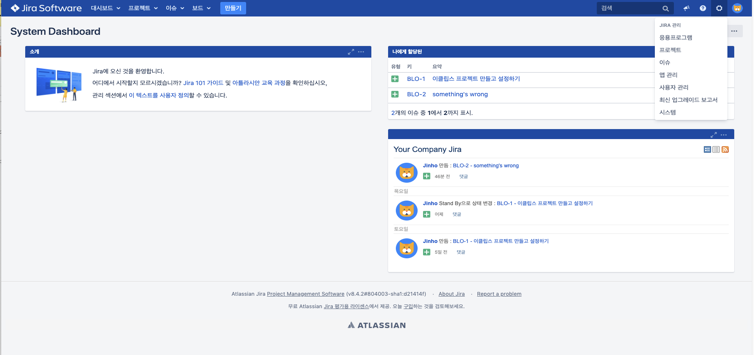
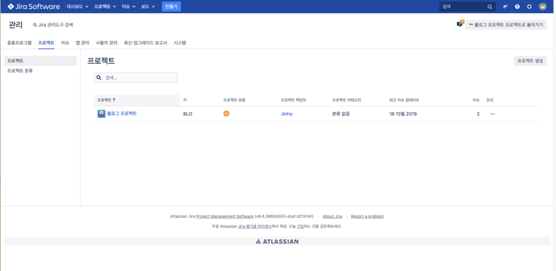
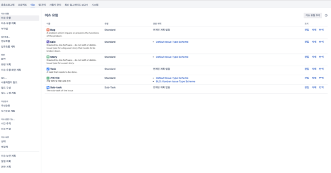
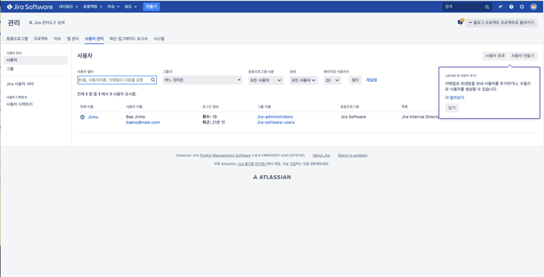

Chapter 2. 협업 툴 활용 A-Z

**서비스 운영에 기본이 되는 협업툴과 클라우드 서비스에 대한 기본적인 지식을 습득합니다.**

Chapter 2-5. (5)Jira 관리자 소개

대부분 강의에 나온 내용을 기반으로 이 강의 보충 설명에는 소스 설명이 조금 더 필요한 경우 첨부하여 작성하였습니다.

> 관리자일 경우에 나오는 설정 버튼 클릭 후 이슈 클릭

> 프로젝트 관리 화면

> 이슈 관리 화면
이슈 유형 – 이슈를 관리 합니다 (새로운 이슈 타입을 생성)
이슈 유형 계획 – 프로젝트에 어떤 이슈 타입을 넣을 수 있을지를 설정합니다. 
업무 흐름 – 업무의 단계를 설정합니다. 
업무 흐름 계획 – 이슈 유형과 업무 흐름을 매핑합니다.
화면 – 편집을 통해서 화면에 보여줄 필드 정보를 추가/수정할 수 있습니다
화면 계획 – 커스터마이즈한 화면을 특정 화면 계획과 연결 시킵니다.
이슈 유형 화면 계획 – 이슈 유형과 화면 계획을 연결합니다. 
사용자 정의 필드 추가 – 사용자가 원하는 형태의 필드를 구성합니다 . 

> 사용자 관리 기능

지라는 강력한 권한 관리 기능과 사용자 관리 기능을 제공합니다.
이번 강의에서 다루지는 않지만 crowd 연동을 통해서 도메인 통합 SSO를 할수도 있습니다. 또한 crowd 의 강력한 계정 관리 기능은
지라의 계정과 지라 컨플루언스의 계정, 그리고 빗버킷의 계정들을 통합해서 관리할 수 있습니다. 
사용자와 그룹 관리가 있습니다. 만약 특정 사용자에게 관리자로 지정하고 싶다면 그룹의 jira-administrators의 그룹에 해당 사용자를 매핑하면 됩니다.
특별히 사용자 이름 뒤에 응용 프로그램이라고 표기가 따로 되어있고 internal 이라는 목록이 표기된 이유는 
다른 계정 정보와 통합시에 발생되는 중복에 대한 관리입니다. 지라는 다른 서비스와의 계정 연동이 가능하도록 설계되어있어서 확장성이
용이한 대신에 계정 정보의 충돌을 막기 위해서 일련의 계정 우선 순위 절차들을 가지고 있습니다. 

**목차**

[Chapter 1. 오리엔테이션과 시작하기](https://gitlab.com/bloodjino1/fastcampus-lecture-codes_aws-docker/-/tree/master/chapter1)

[Chapter 2. 협업 툴 활용 A-Z](https://gitlab.com/bloodjino1/fastcampus-lecture-codes_aws-docker/-/tree/master/chapter2)

 [Chapter 2-1. (1)Jira 협업툴 소개](https://gitlab.com/bloodjino1/fastcampus-lecture-codes_aws-docker/-/tree/master/chapter2/(1)Jira%20협업툴%20소개)

 [Chapter 2-2. (2)Jira 협업툴 설치하기](https://gitlab.com/bloodjino1/fastcampus-lecture-codes_aws-docker/-/tree/master/chapter2/(2)Jira%20협업툴%20설치하기)

 [Chapter 2-3. (3)Jira Issue 이해하기](https://gitlab.com/bloodjino1/fastcampus-lecture-codes_aws-docker/-/tree/master/chapter2/(3)Jira%20Issue%20이해하기)

 [Chapter 2-4. (4)Jira API 소개 및 Postman 활용하기](https://gitlab.com/bloodjino1/fastcampus-lecture-codes_aws-docker/-/tree/master/chapter2/(4)Jira%20API%20소개%20및%20Postman%20활용하기)

 [Chapter 2-5. (5)Jira 관리자 소개](https://gitlab.com/bloodjino1/fastcampus-lecture-codes_aws-docker/-/tree/master/chapter2/(5)Jira%20관리자%20소개)

 [Chapter 2-6. (6)Jira 워크플로우 설정하기](https://gitlab.com/bloodjino1/fastcampus-lecture-codes_aws-docker/-/tree/master/chapter2/(6)Jira%20워크플로우%20설정하기)

 [Chapter 2-7. (7)Jira CustomField 설정하기](https://gitlab.com/bloodjino1/fastcampus-lecture-codes_aws-docker/-/tree/master/chapter2/(7)Jira%20CustomField%20설정하기)

 [Chapter 2-8. (8)Jira DB 구조 설명](https://gitlab.com/bloodjino1/fastcampus-lecture-codes_aws-docker/-/tree/master/chapter2/(8)Jira%20DB%20구조%20설명)

 [Chapter 2-9. (9)Confluence 협업 툴 소개](https://gitlab.com/bloodjino1/fastcampus-lecture-codes_aws-docker/-/tree/master/chapter2/(9)Confluence%20협업%20툴%20소개)

 [Chapter 2-10. (10)Confluence 협업 툴 사용 방법](https://gitlab.com/bloodjino1/fastcampus-lecture-codes_aws-docker/-/tree/master/chapter2/(10)Confluence%20협업%20툴%20사용%20방법)

[Chapter 3. 버전관리와 자동화 빌드 툴 이해하기](https://gitlab.com/bloodjino1/fastcampus-lecture-codes_aws-docker/-/tree/master/chapter3)

[Chapter 4.5. AWS 기본 설정 및 클라우드 서비스 환경 구축,
 AWS 활용 스프링부트 프로젝트 배포 -> 4](https://gitlab.com/bloodjino1/fastcampus-lecture-codes_aws-docker/-/tree/master/chapter4)

[Chapter 6. DOCKER 활용하기-> 5](https://gitlab.com/bloodjino1/fastcampus-lecture-codes_aws-docker/-/tree/master/chapter5)
