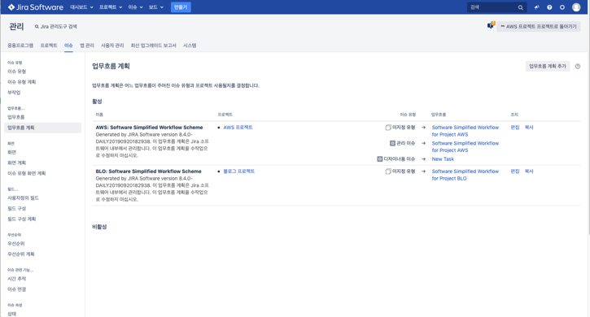

Chapter 2. 협업 툴 활용 A-Z

**서비스 운영에 기본이 되는 협업툴과 클라우드 서비스에 대한 기본적인 지식을 습득합니다.**

Chapter 2-6. (6)Jira 워크플로우 설정하기

대부분 강의에 나온 내용을 기반으로 이 강의 보충 설명에는 소스 설명이 조금 더 필요한 경우 첨부하여 작성하였습니다.

*워크 플로우 설정*

*이슈 계획 가정*
워크 플로우 계획 잡기 (이슈 생성 -> 기획 단계 -> 개발 대기 -> 개발중 -> 개발완료 -> 테스트 단계 -> 운영 반영 단계 -> 완료 단계)

>프로젝트 설정 > 이슈 유형 

>조치 버튼 클릭 > 이슈 유형 계획으로 전환

>미사용 이슈 이동

>원하는 이슈 유형 추가하기 (이슈 유형 계획 탭 > 이슈 유형 추가 클릭)

>기본 화면

>편집 진행 (상태 추가 및 전환 추가)

>상태 추가 화면

>전환 추가 화면 -> 전환은 이전 단계와 다음 단계 설정이 가능 (화살표 생성)

>관리자에서 업무 유형 추가

>업무 흐름 계획에서 편집 클릭

>업무 흐름 확인

>실제 이슈 생성해서 테스트 진행

>이슈의 상태값이 변경 되는 것 확인

>이슈의 상태를 변경하는 API 확인

EX) http://13.124.208.168:8080/rest/api/2/issue/AWS-5/transitions

**목차**

[Chapter 1. 오리엔테이션과 시작하기](https://gitlab.com/bloodjino1/fastcampus-lecture-codes_aws-docker/-/tree/master/chapter1)

[Chapter 2. 협업 툴 활용 A-Z](https://gitlab.com/bloodjino1/fastcampus-lecture-codes_aws-docker/-/tree/master/chapter2)

 [Chapter 2-1. (1)Jira 협업툴 소개](https://gitlab.com/bloodjino1/fastcampus-lecture-codes_aws-docker/-/tree/master/chapter2/(1)Jira%20협업툴%20소개)

 [Chapter 2-2. (2)Jira 협업툴 설치하기](https://gitlab.com/bloodjino1/fastcampus-lecture-codes_aws-docker/-/tree/master/chapter2/(2)Jira%20협업툴%20설치하기)

 [Chapter 2-3. (3)Jira Issue 이해하기](https://gitlab.com/bloodjino1/fastcampus-lecture-codes_aws-docker/-/tree/master/chapter2/(3)Jira%20Issue%20이해하기)

 [Chapter 2-4. (4)Jira API 소개 및 Postman 활용하기](https://gitlab.com/bloodjino1/fastcampus-lecture-codes_aws-docker/-/tree/master/chapter2/(4)Jira%20API%20소개%20및%20Postman%20활용하기)

 [Chapter 2-5. (5)Jira 관리자 소개](https://gitlab.com/bloodjino1/fastcampus-lecture-codes_aws-docker/-/tree/master/chapter2/(5)Jira%20관리자%20소개)

 [Chapter 2-6. (6)Jira 워크플로우 설정하기](https://gitlab.com/bloodjino1/fastcampus-lecture-codes_aws-docker/-/tree/master/chapter2/(6)Jira%20워크플로우%20설정하기)

 [Chapter 2-7. (7)Jira CustomField 설정하기](https://gitlab.com/bloodjino1/fastcampus-lecture-codes_aws-docker/-/tree/master/chapter2/(7)Jira%20CustomField%20설정하기)

 [Chapter 2-8. (8)Jira DB 구조 설명](https://gitlab.com/bloodjino1/fastcampus-lecture-codes_aws-docker/-/tree/master/chapter2/(8)Jira%20DB%20구조%20설명)

 [Chapter 2-9. (9)Confluence 협업 툴 소개](https://gitlab.com/bloodjino1/fastcampus-lecture-codes_aws-docker/-/tree/master/chapter2/(9)Confluence%20협업%20툴%20소개)

 [Chapter 2-10. (10)Confluence 협업 툴 사용 방법](https://gitlab.com/bloodjino1/fastcampus-lecture-codes_aws-docker/-/tree/master/chapter2/(10)Confluence%20협업%20툴%20사용%20방법)

[Chapter 3. 버전관리와 자동화 빌드 툴 이해하기](https://gitlab.com/bloodjino1/fastcampus-lecture-codes_aws-docker/-/tree/master/chapter3)

[Chapter 4.5. AWS 기본 설정 및 클라우드 서비스 환경 구축,
 AWS 활용 스프링부트 프로젝트 배포 -> 4](https://gitlab.com/bloodjino1/fastcampus-lecture-codes_aws-docker/-/tree/master/chapter4)

[Chapter 6. DOCKER 활용하기-> 5](https://gitlab.com/bloodjino1/fastcampus-lecture-codes_aws-docker/-/tree/master/chapter5)
