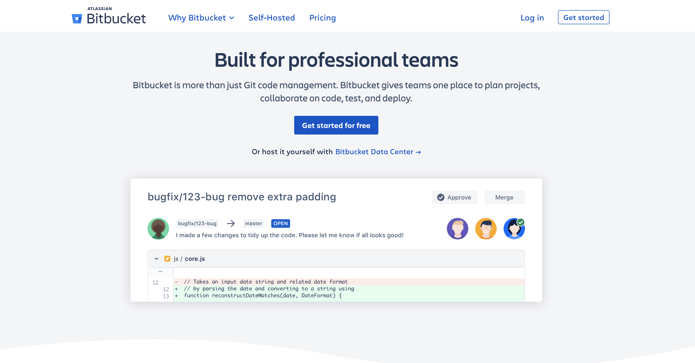
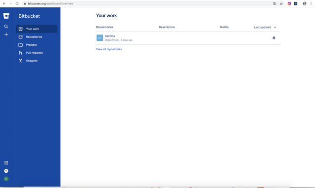
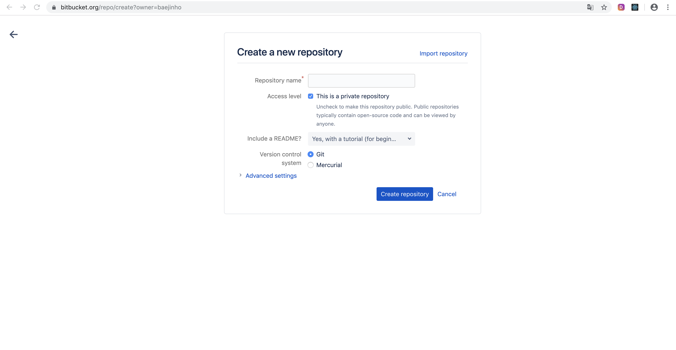
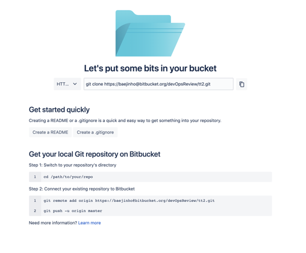
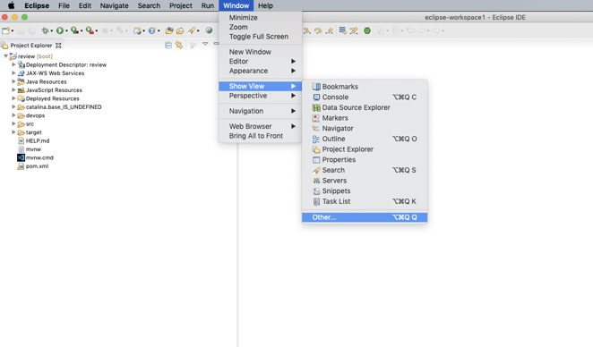
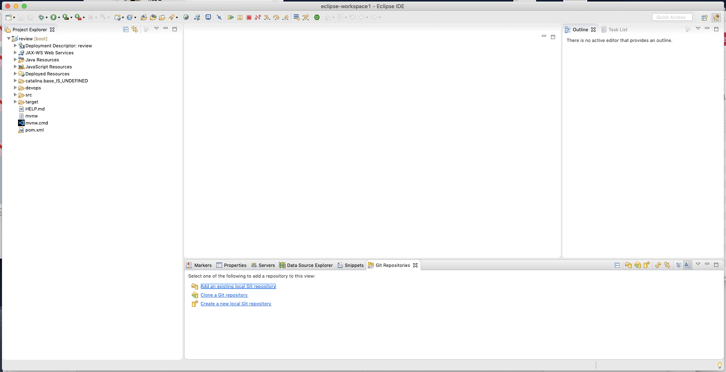
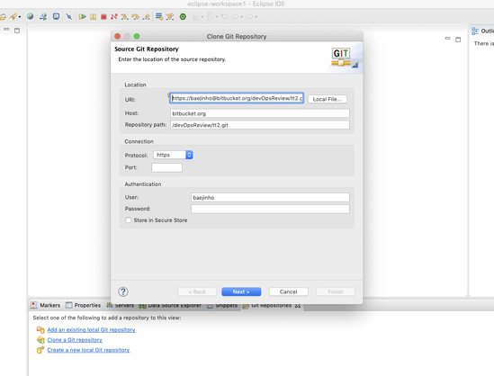

Chapter 3. 버전관리와 자동화 빌드 툴 이해하기

**bitbucket과 Jenkins 툴을 활용하여 협업툴과 연동하는 방법을 학습합니다.**

- Jenkins 협업툴

- Bitbucket 협업툴

>Create Repository 생성

>공개 유무에 따라  체크 > 미체크시 공개

>정상 생성시 화면

* 이클립스와 빗버킷 연동

> 이클립스 마켓에서 Egit 을 다운 받고 우선 연동
> Show View > git > git repositories 선택

> Clone a Repository 선택

> 빗버킷의 URL 붙여넣기

> 처음 세팅시에 기존에 프로젝트를 빗버킷에 올린다.

**목차**

[Chapter 1. 오리엔테이션과 시작하기](https://gitlab.com/bloodjino1/fastcampus-lecture-codes_aws-docker/-/tree/master/chapter1)

[Chapter 2. 협업 툴 활용 A-Z](https://gitlab.com/bloodjino1/fastcampus-lecture-codes_aws-docker/-/tree/master/chapter2)

[Chapter 3. 버전관리와 자동화 빌드 툴 이해하기](https://gitlab.com/bloodjino1/fastcampus-lecture-codes_aws-docker/-/tree/master/chapter3)

[Chapter 4.5. AWS 기본 설정 및 클라우드 서비스 환경 구축,
 AWS 활용 스프링부트 프로젝트 배포 -> 4](https://gitlab.com/bloodjino1/fastcampus-lecture-codes_aws-docker/-/tree/master/chapter4)

[Chapter 6. DOCKER 활용하기-> 5](https://gitlab.com/bloodjino1/fastcampus-lecture-codes_aws-docker/-/tree/master/chapter5)
