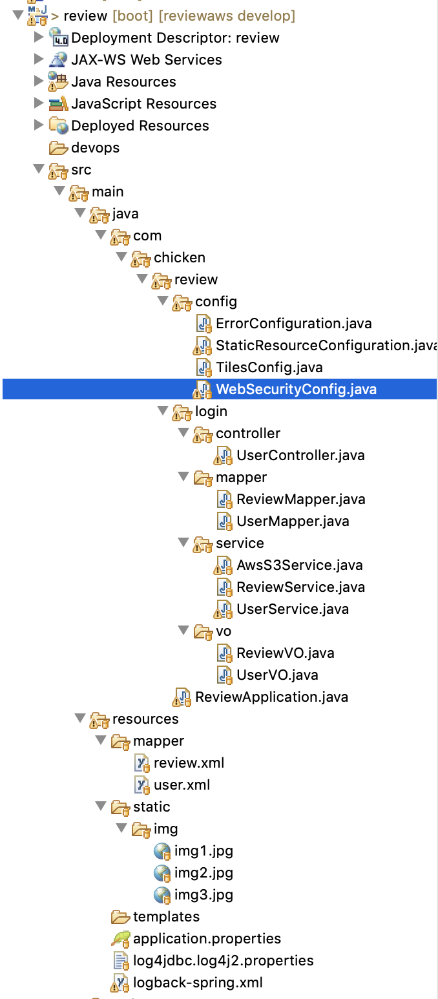
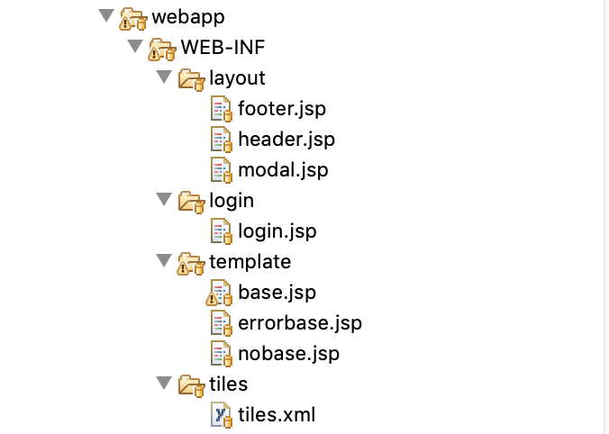

Chapter 4.5. AWS 기본 설정 및 클라우드 서비스 환경 구축,
AWS 활용 스프링부트 프로젝트 배포 -> 4

**AWS를 이해하고 어떻게 클라우드 서비스 환경을 구축하는지 실습을 통해 학습합니다.**

*Chapter 4-1. 스프링 프로젝트 세팅 실습 1*

이클립스 세팅

이클립스 설치 경로 
https://eclipse.org

mvn 세팅
http://maven.apache.org/ 
에서 직접 다운 받거나 이클립의 마켓을 이용한다. 

git 세팅
이클립스의 마켓에서
Egit 설치한다.

소스 설명

> ReviewApplication.java // 스프링 부트 시작 지점 

> ErrorConfiguration.java // 에러 관련 설정

> StaticResourceConfiguration.java // css, js, img 같은 고정된 리소스 파일들 설정

> TilesConfig.java // tiles 관련 설정

> WebSecurityConfig.java // 웹 보안 관련설정

> UserController.java  // 로그인 관련 처리 MVC 중에 view 부분

> ReviewMapper.java  // 오프라인 리뷰 관련 쿼리를 매핑하는 매퍼

> UserMapper.java    // 유저 관련 쿼리를 매핑하는 매퍼

> AwsS3Service.java  // S3 와 연동을 담당하는 서비스 부분

> ReviewService.java  // 리뷰 매퍼와 연동해주는 서비스 부분 (기능별로 리뷰작성, 리뷰 리스트 보기 등등 설정)

> UserService.java    // 유저 매퍼와 연동해주는 서비스 부분 (로그인을 위해서 유저가 있는지 없는지 확인 및 유저 관련된 데이터를 바인딩)

> ReviewVO.java // 리뷰 관련 VO (또는 DTO)

> UserVO.java   // 유저 관련 VO (또는 DTO)

> footer.jsp // 화면상 하단 화면부

> header.jsp // 화면상 상단 화면부

> modal.jsp  // 모달 팝업 관련 부

> login.jsp  // 로그인 및 메인 화면 관련

> base.jsp   // 타일즈 화면 세팅 부분 (상단, 하단, 가운데 화면을 연결한다)

> errorbase.jsp // 에러 화면 세팅 부분

> nobase.jsp // 타일즈 화면 세팅 부분 (하단, 가운데 화면을 연결한다)

> tiles.xml // 타일즈 관련 세팅

> review.xml  // 리뷰 관련 쿼리(myBatis) - 자바의 매퍼랑 연동한다

> user.xml    // 유저 관련 쿼리(myBatis)  - 자바의 매퍼랑 연동한다

> application.properties // 스프링 부트 관련 다양한 세팅을 프로퍼티로 관리한다(디비 연결, 포트 세팅 등등)

> log4jdbc.log4j2.properties  // 로그 관련 세팅

> logback-spring.xml   // 로그 관련 세팅

> pom.xml  // 라이브러리 관련해서 세팅한다

위 파일을 스프링 mvn 빌드를 통해서 WAR 파일로 뽑아내게 됩니다. (강의에 첨부)

이 WAR 파일을 서버상에 올리고 서버에서 톰켓 설정시에 server.xml 파일을 수정하게 될 경우가 생기는데 해당 파일 정보를 공유드립니다.

https://gitlab.com/bloodjino1/fastcampus-lecture-codes_aws-docker/-/blob/master/chapter3/server.xml

**목차**

[Chapter 1. 오리엔테이션과 시작하기](https://gitlab.com/bloodjino1/fastcampus-lecture-codes_aws-docker/-/tree/master/chapter1)

[Chapter 2. 협업 툴 활용 A-Z](https://gitlab.com/bloodjino1/fastcampus-lecture-codes_aws-docker/-/tree/master/chapter2)

[Chapter 3. 버전관리와 자동화 빌드 툴 이해하기](https://gitlab.com/bloodjino1/fastcampus-lecture-codes_aws-docker/-/tree/master/chapter3)

[Chapter 4.5. AWS 기본 설정 및 클라우드 서비스 환경 구축,
 AWS 활용 스프링부트 프로젝트 배포 -> 4](https://gitlab.com/bloodjino1/fastcampus-lecture-codes_aws-docker/-/tree/master/chapter4)

[Chapter 4-1. 스프링 프로젝트 세팅 실습 1](https://gitlab.com/bloodjino1/fastcampus-lecture-codes_aws-docker/-/tree/master/chapter4/(1)spring_project)

[Chapter 4-2. jenkins  실습](https://gitlab.com/bloodjino1/fastcampus-lecture-codes_aws-docker/-/tree/master/chapter4/(2)jenkins)

[Chapter 4-3. AWS RDS 설정](https://gitlab.com/bloodjino1/fastcampus-lecture-codes_aws-docker/-/tree/master/chapter4/(3)aws_rds)

[Chapter 4-4. AWS S3 설정](https://gitlab.com/bloodjino1/fastcampus-lecture-codes_aws-docker/-/tree/master/chapter4/(4)aws_s3)

[Chapter 4-5. AWS 카카오 로그인](https://gitlab.com/bloodjino1/fastcampus-lecture-codes_aws-docker/-/tree/master/chapter4/(5)aws_kakao)

[Chapter 4-6. AWS S3 이미지 업로드](https://gitlab.com/bloodjino1/fastcampus-lecture-codes_aws-docker/-/tree/master/chapter4/(6)s3_upload)

[Chapter 4-7. Jenkins Pipe Line 만들기](https://gitlab.com/bloodjino1/fastcampus-lecture-codes_aws-docker/-/tree/master/chapter4/(7)jenkins_pipeline)

[Chapter 6. DOCKER 활용하기-> 5](https://gitlab.com/bloodjino1/fastcampus-lecture-codes_aws-docker/-/tree/master/chapter5)
