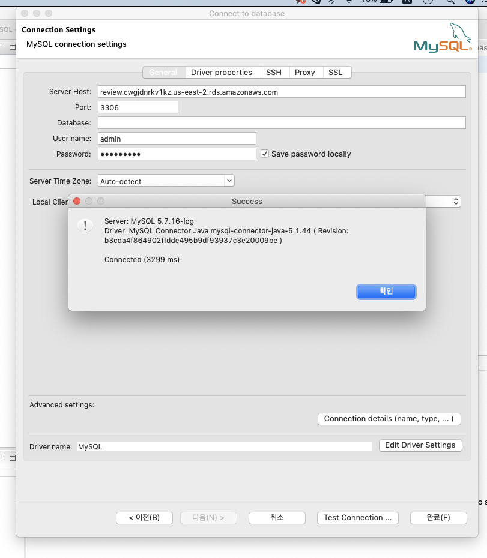

Chapter 4.5. AWS 기본 설정 및 클라우드 서비스 환경 구축,
AWS 활용 스프링부트 프로젝트 배포 -> 4


**AWS를 이해하고 어떻게 클라우드 서비스 환경을 구축하는지 실습을 통해 학습합니다.**

*Chapter 4-3. AWS RDS 설정*


>AWS Console 접속 > Service > RDS 검색


>RDS 접속 화면 > 데이터 베이스 생성 버튼 클릭


> 익숙하고 가장 많이 사용하는 버젼 채택 > mysql > 5.7 버젼 영역 선택 (원하는 버젼 임의로 선택 가능)


> 템플릿을 프리티어를 사용하고, 데이터 베이스 명은 사용하고자 하는 명칭을 사용 (여기에서는 review 라고 명명)


> 자격 증명의 경우 DB 의 root 권한으로 생각하면 됨. 어드민 계정 정보와 패스워드 정보를 입력 (잊어버리면 안됩니다!)


> 스토리지의 경우 테스트 용으로는 최소값을 사용해도 무방 (백업 유무도 세팅할 수 있지만 테스트 용에서는 무방)


> 데이터 베이스 생성 버튼을 통해 데이터 베이스 생성


> RDS 데이터 베이스 생성된 화면


> 해당 데이터 베이스 클릭시 접속 화면


> 데이터 베이스 클릭 후 수정 후 퍼블릭 Access 를 공개로 설정 > 이렇게 설정해야 툴을 통해서 접속이 가능합니다.


> endpoint 와 포트 확인

* DB접속하기 *

DB 접속 무료 툴 : DBeaver - https://dbeaver.io/
- 무료 중에서 강력한 도구
Heidisql - https://www.heidisql.com/  중에서 선택해서 사용

DBeaver 설치법은 https://www.google.com/search?q=DBeaver+%EC%84%A4%EC%B9%98%EB%B2%95&oq=DBeaver+%EC%84%A4%EC%B9%98%EB%B2%95&aqs=chrome..69i57j0l7.2923j0j7&sourceid=chrome&ie=UTF-8 사이트 참고해서 진행


DBeaver에서 플러그 버튼 클릭 새 데이터 베이스 연결


> 강의에 나온 것처럼 인바운스 보안에 3306 포트와 내 아이피를 추가


> 엔드 포인트에 나오는 주소와 3306 포트 그리고 미리 세팅했던 계정 루트 정보를 입력후 test connection
> 정상적일 경우 연결됨


> 정상 연결시 빈 데이터 베이스

데이터 베이스 생성


> 데이터 베이스 생성 버튼 클릭


> 데이터 베이스 정보 입력 (utf8)
> 생성된 데이터 베이스를 클릭


> Create Table 을 눌러서 테이블을 만들어 줍니다. > charater set 은 utf8 
> user 테이블 생성


> Properties - Column 탭에서 하단에 화면 우클릭 이후에 Create Column 을 눌러서 하위 column 을 생성해 줍니다.
> 아래 테이블 정보를 활용합니다. 


각각 column 정보를 입력해서 테이블을 구성합니다.

우측 하단에 저장 버튼을 눌러서 테이블을 갱신해 줍니다.

하단의 DDL 을 참고해서 해당 쿼리를 직접 입력해 주셔서 생성해도 됩니다.


* DB 생성 

사용 테이블 : user, review

user Table 스키마
column : id  (int) /
column : nickname (varchar(100)) /
column : email  (varchar(200))


review Table 스키마
column : userId (int) /
column : title (varchar(100)) /
column : content text /
column : createDt (DateTime) /
column : s3ImageUrl (varchar(255)) 


```
/* user 생성 쿼리 */
CREATE TABLE review.`user` (
	id INT NULL,
	email varchar(200) NULL,
	nickName varchar(100) NULL
)
ENGINE=InnoDB
DEFAULT CHARSET=utf8
COLLATE=utf8_general_ci;
```


```
CREATE TABLE `review` (
  `userId` int(11) DEFAULT NULL,
  `title` varchar(100) DEFAULT NULL,
  `content` text,
  `createDt` datetime DEFAULT NULL,
  `s3ImageUrl` varchar(255) DEFAULT NULL
) ENGINE=InnoDB DEFAULT CHARSET=utf8
```

**목차**

[Chapter 1. 오리엔테이션과 시작하기](https://gitlab.com/bloodjino1/fastcampus-lecture-codes_aws-docker/-/tree/master/chapter1)

[Chapter 2. 협업 툴 활용 A-Z](https://gitlab.com/bloodjino1/fastcampus-lecture-codes_aws-docker/-/tree/master/chapter2)

[Chapter 3. 버전관리와 자동화 빌드 툴 이해하기](https://gitlab.com/bloodjino1/fastcampus-lecture-codes_aws-docker/-/tree/master/chapter3)

[Chapter 4.5. AWS 기본 설정 및 클라우드 서비스 환경 구축,
 AWS 활용 스프링부트 프로젝트 배포 -> 4](https://gitlab.com/bloodjino1/fastcampus-lecture-codes_aws-docker/-/tree/master/chapter4)


[Chapter 4-1. 스프링 프로젝트 세팅 실습 1](https://gitlab.com/bloodjino1/fastcampus-lecture-codes_aws-docker/-/tree/master/chapter4/(1)spring_project)

[Chapter 4-2. jenkins  실습](https://gitlab.com/bloodjino1/fastcampus-lecture-codes_aws-docker/-/tree/master/chapter4/(2)jenkins)

[Chapter 4-3. AWS RDS 설정](https://gitlab.com/bloodjino1/fastcampus-lecture-codes_aws-docker/-/tree/master/chapter4/(3)aws_rds)

[Chapter 4-4. AWS S3 설정](https://gitlab.com/bloodjino1/fastcampus-lecture-codes_aws-docker/-/tree/master/chapter4/(4)aws_s3)

[Chapter 4-5. AWS 카카오 로그인](https://gitlab.com/bloodjino1/fastcampus-lecture-codes_aws-docker/-/tree/master/chapter4/(5)aws_kakao)

[Chapter 4-6. AWS S3 이미지 업로드](https://gitlab.com/bloodjino1/fastcampus-lecture-codes_aws-docker/-/tree/master/chapter4/(6)s3_upload)

[Chapter 4-7. Jenkins Pipe Line 만들기](https://gitlab.com/bloodjino1/fastcampus-lecture-codes_aws-docker/-/tree/master/chapter4/(7)jenkins_pipeline)


[Chapter 6. DOCKER 활용하기-> 5](https://gitlab.com/bloodjino1/fastcampus-lecture-codes_aws-docker/-/tree/master/chapter5)
