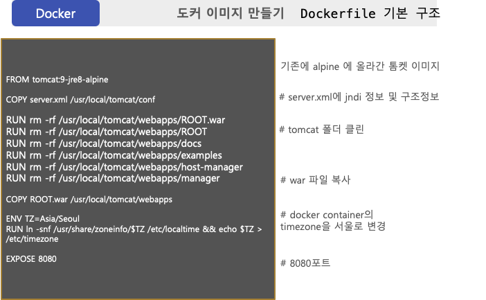

Chapter 5. Docker 활용




Dockerfile 소스 

```
FROM tomcat:9-jre8-alpine 
  
COPY server.xml /usr/local/tomcat/conf

RUN rm -rf /usr/local/tomcat/webapps/ROOT.war
RUN rm -rf /usr/local/tomcat/webapps/ROOT
RUN rm -rf /usr/local/tomcat/webapps/docs
RUN rm -rf /usr/local/tomcat/webapps/examples
RUN rm -rf /usr/local/tomcat/webapps/host-manager
RUN rm -rf /usr/local/tomcat/webapps/manager

COPY ROOT.war /usr/local/tomcat/webapps

ENV TZ=Asia/Seoul
RUN ln -snf /usr/share/zoneinfo/$TZ /etc/localtime && echo $TZ > /etc/timezone
EXPOSE 8080
```

도커 이미지 빌드하기 > 해당 도커 파일이 있는 위치에서 아래 명령어를 실행한다. (제일 뒤에는 빌드하고자 하는 도커의 이름)
```
docker build -t review/aws 
```

도커 이미지 확인하기
```
docker images
```


도커 이미지 삭제하기(도커 이미지를 확인한 리스트에 나온 IMAGE ID 정보를 제일 뒤에 입력한다.)
```
docker rmi (image id)
```

도커 이미지 실행하기 (run) - 위에서 빌드한 이미지 명을 이용한다.
```
docker run --rm -d -p 8080:8080 review/aws 
```
> -p 뒤에는 사용하고자 하는 포트 정보를 넣어준다


**목차**

[Chapter 1. 오리엔테이션과 시작하기](https://gitlab.com/bloodjino1/fastcampus-lecture-codes_aws-docker/-/tree/master/chapter1)

[Chapter 2. 협업 툴 활용 A-Z](https://gitlab.com/bloodjino1/fastcampus-lecture-codes_aws-docker/-/tree/master/chapter2)

[Chapter 3. 버전관리와 자동화 빌드 툴 이해하기](https://gitlab.com/bloodjino1/fastcampus-lecture-codes_aws-docker/-/tree/master/chapter3)

[Chapter 4.5. AWS 기본 설정 및 클라우드 서비스 환경 구축,
 AWS 활용 스프링부트 프로젝트 배포 -> 4](https://gitlab.com/bloodjino1/fastcampus-lecture-codes_aws-docker/-/tree/master/chapter4)

[Chapter 6. DOCKER 활용하기-> 5](https://gitlab.com/bloodjino1/fastcampus-lecture-codes_aws-docker/-/tree/master/chapter5)
